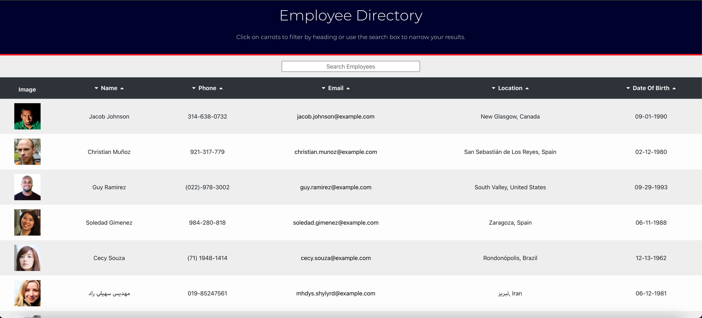
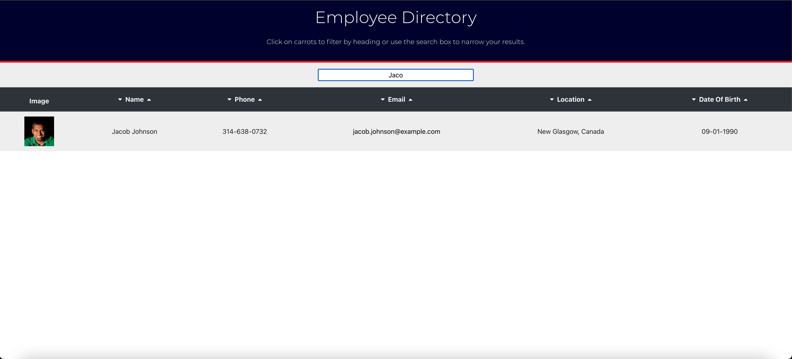
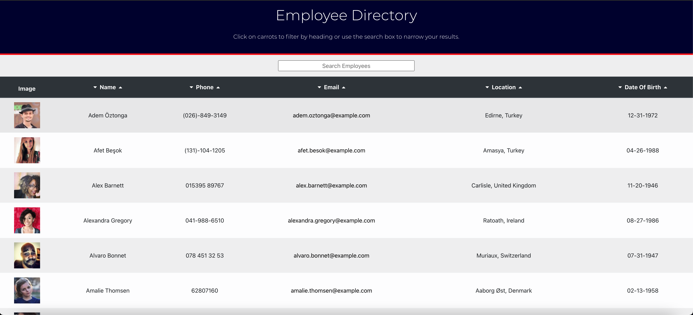

# employee-directory

## Approach 

This employee directory is comprised of many working parts that all seamlessly come together to build a polished, professional application that keeps track of all employees. The user is able to view the enite employee directory at once, from there they can filter the directory by name, phone, email, location and date of birth by typing in the search bar. Once they start to type, any employees that match will start to be filtered and only those matching the query are returned. This greatly benefits an employee or manager as they are able to view non-sensitive data about other employees at a glance. On top of being able to filter employees by name, the user is also able to sort the employess based on any of the properties, including name, phone, email, location and date of birth. Not only can all of these categpries be sorted but they can be sorted in either ascending or descending order. To do this all the user has to do is either click on the caret down icon or the caret icon to do the corresponding sort. The user is prompted to do this in the heading of the application, having clear instructions like this lend to a better user experinece and therefore more return users of this application. The driving force behind this application is the use of react.js and the brilliant framework they provide. Using the create react app gives us the ability to easily implement react and all of the complex systems that come with it. One of the key features of react is the modularity of the entire system, being able to pass in components for each and every aspect of a project is key to the reusability of the application and lends to better future development. In the future this will be a full stack application using the MERN stack, following the MVC paradigm, in this case react.js is the V in MVC, handling the view for the user. All of this comes together to make a user friendly, employee directory that will enable employees and managers to better keep track and stay up to date with their current work force.

## User Story
As a user, I want to be able to view my entire employee directory at once so that I have quick access to their information.

## Installation

To install this repo on your local drive you would have to clone the ssh key from my repo. Head into your local drive of choice in terminal or bash and do a git clone. Once you have done a git clone you are free to start working on this project. If you want to push your changes to my repo then you would have to head into terminal/bash and do a git add . Then a git commit -m explaning the changes made, and finally a git push to push the files onto the repo. 

## Usage 

If you want to use this program on the front end then simply click on the link in the finished project section of this read me. If you would like to experiment with the code itself and see what you can come up with, first do a git clone as previously described in the installation section. Once you have the all the folders in your vs code, make sure you do a npm install in the command line to install all the dependencies listed in the package.json. Go into the intergrated terminal and run the command npm start. This will spin up a local server enabling you to make changes in your editor of choice and see them in the browser. 

## Finished project
Check out the live application on <a href=https://mattrward1030.github.io/employee-directory/>Github pages!</a>

## Features
<ul>
<li>A employee directory that will help employees and managers to easily view their work force</li>
<li>The user is able to view their employees in a nicely laid out table.</li>
<li>Can filter the users by name, phone, email, location and date of birth by using the search bar at the top of the application.</li>
<li>When the user starts to type every employee that doesn't match the search query will be filtered out.</li>
<li>The user can sort the employees on multiple properties.</li>
<li>Employees can be sorted by name, phone, email, location and date of birth.</li>
<li>These properties can be sorted both ascending and descending by clicking on the correspondong carrot listed on either side of the table header.</li>
<li>If user clicks on the email address of the user then their email application of choice is loaded and they are able to send the employee an email. </li>
<li>This application is powered by react.js. </li>
<li>Future development, this wil be part of a full MERN stack application. </li>
<li>Will follow the MVC paradigm, react being the View that the user sees on the front end</li>
<li>Using JSX syntax we are able to easily write front end looking code in the javascript files.</li>
<li>Application is hosted on <a href="https://mattrward1030.github.io/employee-directory/">Github pages!</a></li>
</ul>

## Tests
N/A 

## Credits
N/A

## Contributing

Pull requests are welcome and encouraged. Hit me up on my github <a href="https://github.com/mattrward1030">mattrward1030</a>

## Badges
 

## License

MIT License

Copyright (c) [2021] [Matthew Ward]

Permission is hereby granted, free of charge, to any person obtaining a copy
of this software and associated documentation files (the "Software"), to deal
in the Software without restriction, including without limitation the rights
to use, copy, modify, merge, publish, distribute, sublicense, and/or sell
copies of the Software, and to permit persons to whom the Software is
furnished to do so, subject to the following conditions:

The above copyright notice and this permission notice shall be included in all
copies or substantial portions of the Software.

THE SOFTWARE IS PROVIDED "AS IS", WITHOUT WARRANTY OF ANY KIND, EXPRESS OR
IMPLIED, INCLUDING BUT NOT LIMITED TO THE WARRANTIES OF MERCHANTABILITY,
FITNESS FOR A PARTICULAR PURPOSE AND NONINFRINGEMENT. IN NO EVENT SHALL THE
AUTHORS OR COPYRIGHT HOLDERS BE LIABLE FOR ANY CLAIM, DAMAGES OR OTHER
LIABILITY, WHETHER IN AN ACTION OF CONTRACT, TORT OR OTHERWISE, ARISING FROM,
OUT OF OR IN CONNECTION WITH THE SOFTWARE OR THE USE OR OTHER DEALINGS IN THE
SOFTWARE.
